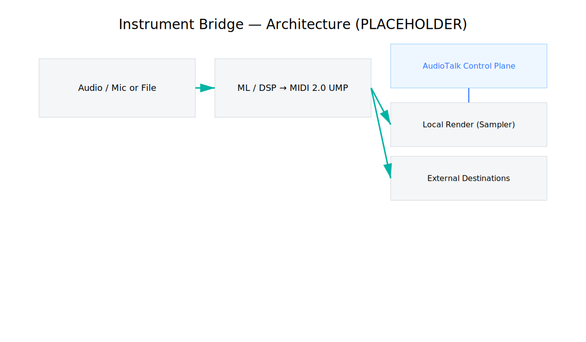
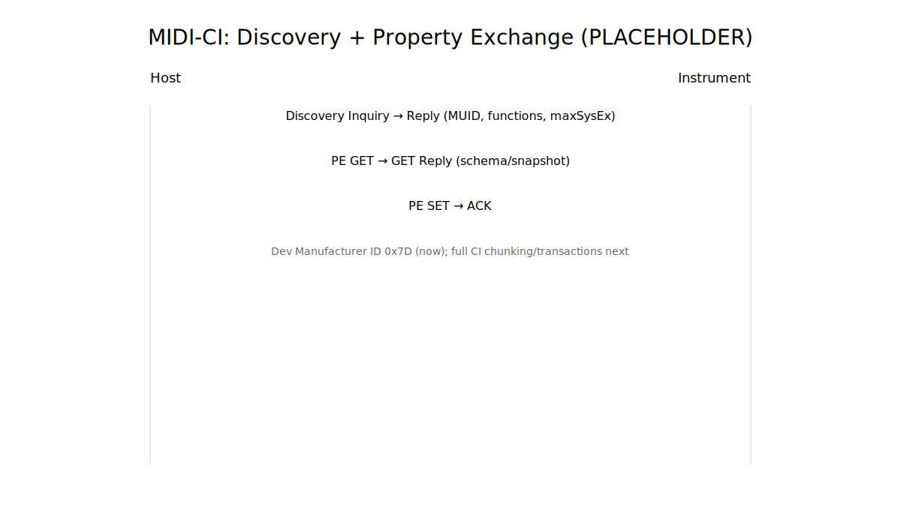
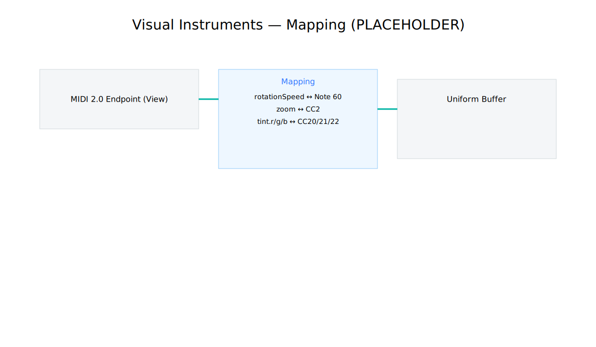
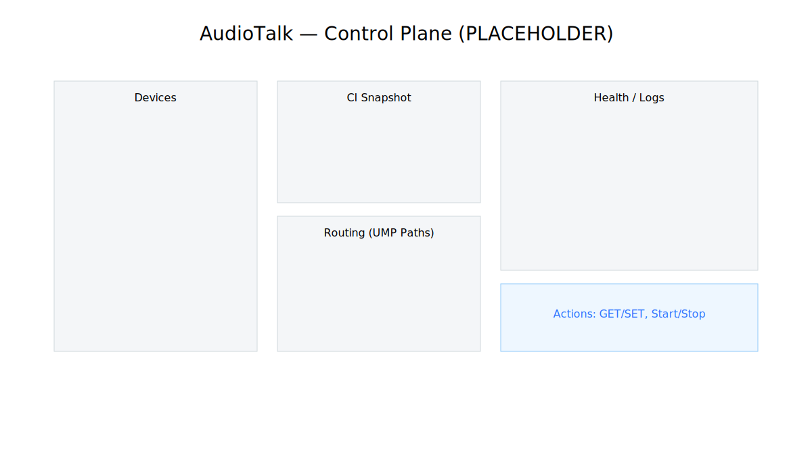

## Instrument Bridge — A Human Guide (MIDI 2.0 × Sampler × ML × AudioTalk)

Audience: musicians, producers, creative coders, and integrators.

Why this matters
- MIDI 1.0 samplers were powerful but opaque; users relied on presets, CC guesswork, or tools like Autosampler to freeze sounds.
- Instrument Bridge uses MIDI 2.0 + MIDI‑CI to make instruments self‑describing and configurable; ML/audio tools emit expressive UMP events; and a built‑in sampler renders in‑process for instant feedback.

What you get
- Discoverability: instruments tell you who they are and what they can do (CI Discovery + Property Exchange).
- Expressivity: per‑note controllers, 32‑bit velocity, high‑resolution pitch bend.
- Determinism: property snapshots and reproducible sessions (ETags, logs).
- Instant feedback: in‑process sampler render while still sending MIDI 2.0 out.

Quick start
- Generate a tone: `bash Scripts/audio/tonegen.sh --type sine --freq 440 --dur 1`
- Monophonic pipeline (DSP fallback):
  - `swift run --package-path Packages/FountainApps ml-audio2midi --file Public/Audio/sine_440_1s.wav --render --publish-map`
- Poly pipeline (spectral fallback):
  - `swift run --package-path Packages/FountainApps ml-basicpitch2midi --file Public/Audio/sine_440_1s.wav --render --publish-map`
- Simple in‑process synth demo:
  - `swift run --package-path Packages/FountainApps ml-sampler-smoke --pattern arp --wave triangle --duration 4`

How it fits together

- ML / DSP produces MIDI 2.0 UMP (NoteOn/Off, PB, CC, PE).
- Same stream feeds local render (sampler) and external destinations (DAWs, hardware, network).
- AudioTalk provides a control plane to route, query CI, set properties, and monitor health.

Property Exchange and Discovery (MIDI‑CI)

- Discovery: hosts learn identity, supported functions, and max SysEx.
- Property Exchange: fetch/set named properties; Bridge snapshots parameters in JSON until full CI envelopes are rolled out.

Visual instruments (MetalViewKit)

- Views expose per‑view virtual endpoints.
- Uniforms (rotation, zoom, tint, etc.) map to Channel Voice messages.
- CI publishes view identity and tunables for deterministic recall.

AudioTalk

- Enumerate instruments, fetch CI snapshots, set properties, route streams.
- Separate operator concerns (health/logs) from composer flow.

What’s implemented now
- MIDI 2.0 transports (CoreMIDI) and CI scaffolding with vendor JSON snapshots.
- Sampler integration (Midi2SamplerDSP v0.1.1), RealTimeNoteProcessor bridged via AVAudioEngine.
- Visual instruments with per‑view endpoints and uniform mapping.
- ML/audio pipelines with local render; GPU compute + Core ML interop foundations.

Roadmap (selected)
- Full CI transactions/chunking with spec‑accurate Discovery/PE.
- Unified, typed property schema for sampler and visuals.
- Model upgrades (CREPE/YAMNet/BasicPitch) with fixtures and gating.
- AudioTalk OpenAPI endpoints for CI, properties, and routing.

Notes about images
- The diagrams above are placeholders. See `Design/prompts/InstrumentBridge.image_prompts.md` for gen‑prompts and replace the SVGs in `Design/diagrams/` to finalize the doc.

